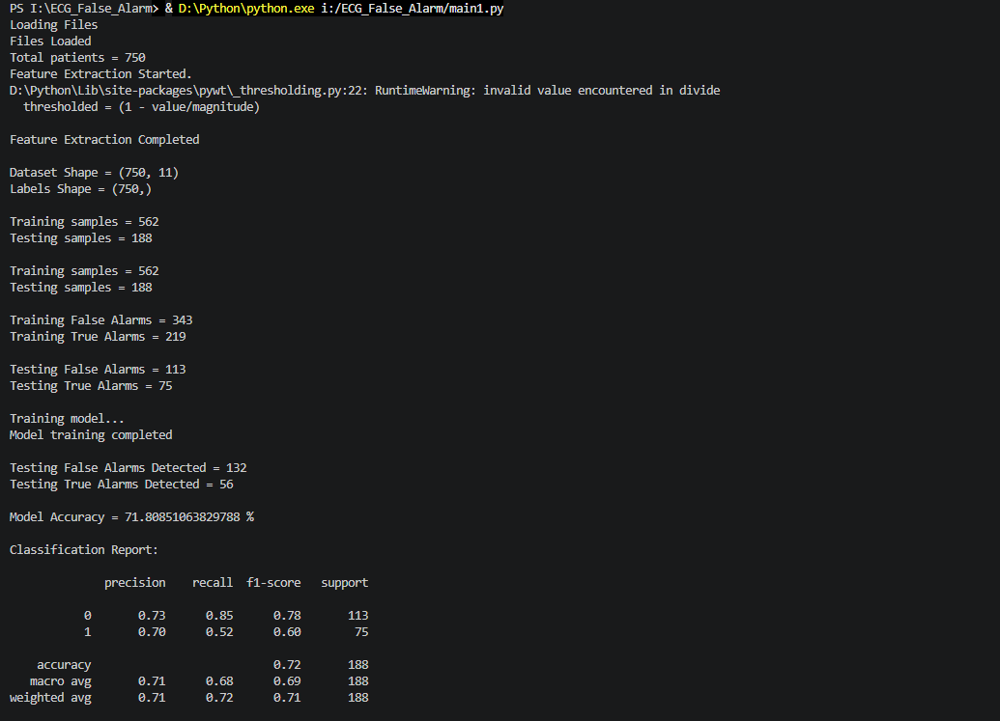

# ECG False Alarm Detection using Machine Learning

A Python-based biomedical signal processing and machine learning project for detecting false ECG alarms. The project uses Discrete Wavelet Transform (DWT) for signal denoising, extracts physiological features from ECG, ABP, and PPG signals, and trains a Random Forest classifier to distinguish between true and false alarms.

---

## 📸 Model Results



---

## ✨ Features

- ECG, ABP and PPG signal processing
- Noise removal using Discrete Wavelet Transform (DWT)
- Automatic feature extraction
- Machine Learning based alarm classification
- Random Forest Classifier
- Performance evaluation using Accuracy, Precision, Recall and F1-score

---

## 🛠 Technologies Used

- Python
- NumPy
- Pandas
- SciPy
- PyWavelets
- Scikit-learn
- Machine Learning
- Biomedical Signal Processing

---

## 📂 Dataset

The project processes physiological signals from:

- ECG (Lead II)
- ABP (Arterial Blood Pressure)
- PPG (Photoplethysmography)

A total of **750 patient records** were used for feature extraction and classification.

---

## ⚙️ Workflow

```
Input Signals
      │
      ▼
Load ECG, ABP & PPG Data
      │
      ▼
DWT Noise Removal
      │
      ▼
Feature Extraction
      │
      ▼
Create Feature Dataset
      │
      ▼
Train/Test Split
      │
      ▼
Random Forest Classifier
      │
      ▼
False Alarm Prediction
```

---

## 📊 Extracted Features

### ECG

- Heart Rate
- RR Interval Standard Deviation
- Heart Rate Variability
- QRS Peak
- Signal Quality Index

### ABP

- Signal Amplitude
- Signal Variance

### PPG

- Pulse Rate
- Signal Standard Deviation

### Common

- Signal Energy
- Signal Entropy

---

## 📈 Model Performance

| Metric | Value |
|---------|-------|
| Dataset Size | 750 Patients |
| Features | 11 |
| Training Samples | 562 |
| Testing Samples | 188 |
| Machine Learning Model | Random Forest |
| Accuracy | **71.81%** |

---

## 📦 Python Libraries

- Pandas
- NumPy
- PyWavelets
- SciPy
- Scikit-learn

---

## 🚀 Future Improvements

- Deep Learning models (CNN/LSTM)
- Hyperparameter tuning
- Real-time ECG monitoring
- Improved feature engineering
- Better handling of missing physiological signals

---

## 👨‍💻 Author

**Sushanth J**

Electronics and Communication Engineering Student
